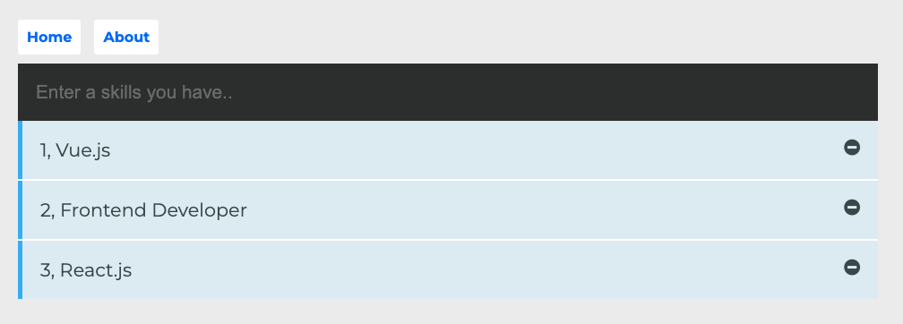

# Vue-skills
This is a simple app to get started with vue.js

## Get started

1. Fork this repository
2. Clone it in your local machine `git clone https://github.com/<YOUR_USERNAME/Vue-Skills.git`

## Project local setup

`npm install`   : Install the dependencies in the local _node_modules_ folder

`npm run serve` : Compiles and hot-reloads for development

`npm run build` :  Compiles and minifies for production

`npm run lint`  : Run lint

## Customize configuration
See [configuration reference](https://cli.vuejs.org/config/)

## UI Look

## Contribute
1. Add and commit changes to your branch
2. Push local changes to origin
3. Open a PR from your branch to the master repo
